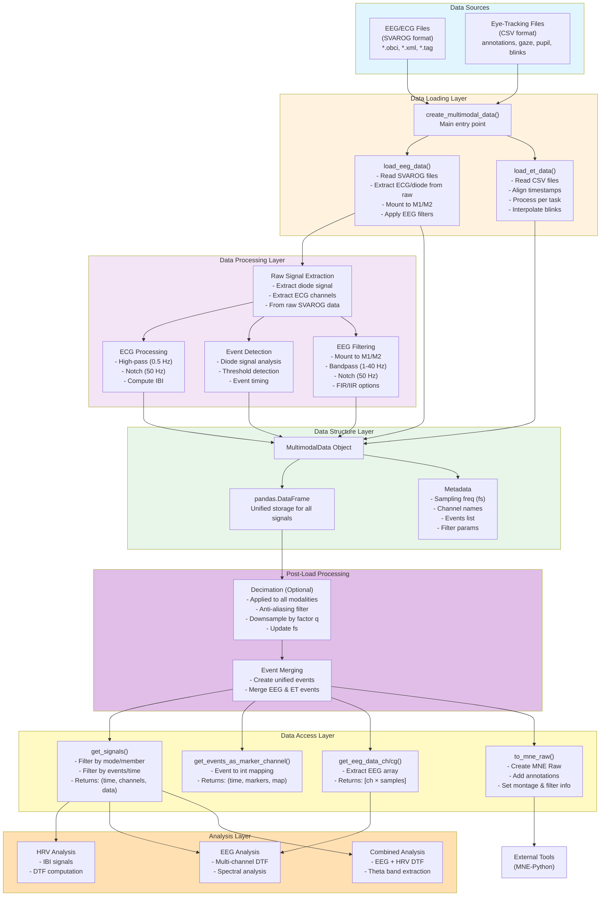
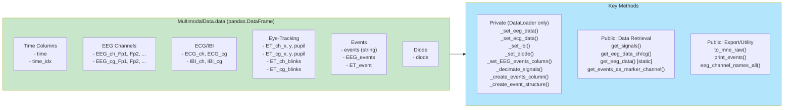
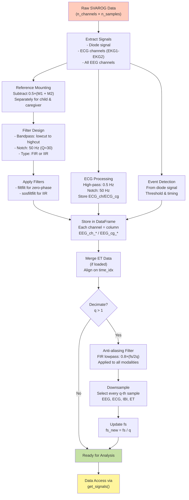
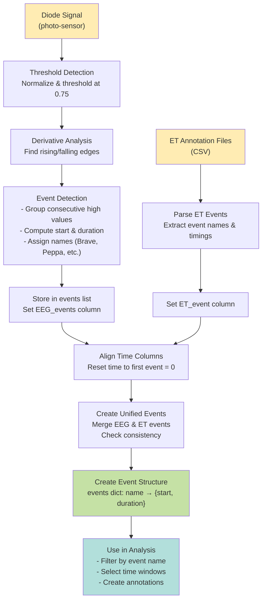
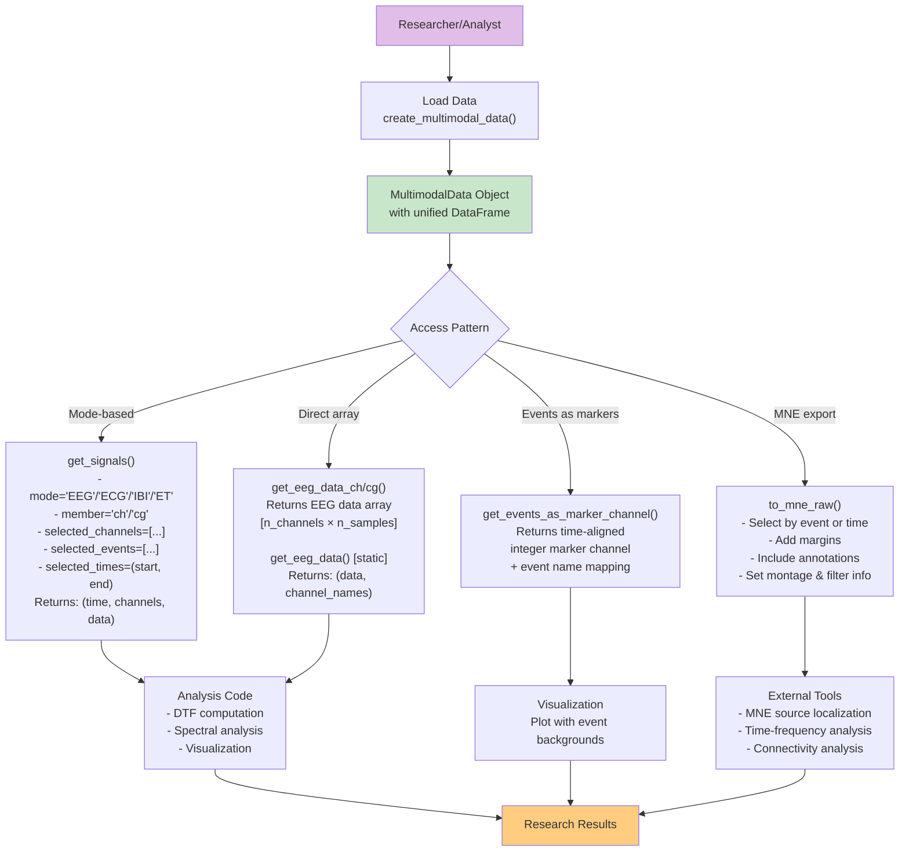

# Hyperscanning Signal Analysis - Architecture Diagram

**Version:** 1.1  
**Last updated:** 2026-01-30  
**Author:** Joanna Duda-Goławska/Jarosław Żygierewicz

## System Architecture Overview



## Detailed Component Diagram



## Signal Processing Pipeline



## Event Processing Flow



## Data Access Patterns



## File Organization

```
hyperscanning-signal-analysis/
├── data/
│   └── {dyad_id}/
│       ├── eeg/
│       │   ├── {dyad_id}.obci      # Binary EEG data
│       │   ├── {dyad_id}.xml       # Channel configuration
│       │   └── {dyad_id}.tag       # Event markers
│       └── et/
│           ├── child/
│           │   ├── 000/            # Movies task
│           │   ├── 001/            # Talk 1 task
│           │   └── 002/            # Talk 2 task
│           └── caregiver/
│               ├── 000/
│               ├── 001/
│               └── 002/
│
├── src/
│   ├── dataloader.py              # Main data loading & processing
│   ├── data_structures.py         # MultimodalData class
│   ├── eyetracker.py              # ET-specific processing
│   ├── utils.py                   # Plotting & utility functions
│   └── mtmvar.py                  # DTF computation
│
├── scripts/
│   ├── mne_export_demo.ipynb      # MNE export examples
│   ├── get_data_demo.ipynb        # Data access examples
│   ├── filter_demo.ipynb          # Filter design & testing
│   ├── decimation_test.ipynb      # Decimation testing
│   ├── EEG_ET_synch_test.ipynb    # Synchronization checks
│   ├── Example_DataLoader_usage.ipynb
│   └── warsaw_pilot_data.py       # Analysis pipeline
│
├── tests/
│   ├── test_dataloader.py
│   └── test_data_structures.py
│
└── docs/
    ├── data_structure_spec.md
    └── architecture_diagram.md     # This file
```

## Key Design Principles

1. **Unified Storage**: All signals (EEG, ECG, IBI, ET) stored in single DataFrame
2. **Common Sampling**: All signals resampled to common `fs` (typically 1024 Hz or decimated)
3. **Time Alignment**: Time column aligned so first movie event starts at t=0
4. **Flexible Access**: Multiple methods to retrieve data (`get_signals()`, `get_eeg_data_ch/cg()`) by mode, member, event, or time
5. **Immutable Decimation**: `_decimate_signals()` returns new object, preserves original
6. **Event Integration**: Events from both EEG (diode) and ET (annotations) merged and validated
7. **MNE Compatibility**: Export to MNE format with proper annotations and filter info via `to_mne_raw()`
8. **Modular Processing**: Separate functions for loading, filtering, and processing each modality
9. **Encapsulation**: Private methods (prefixed with `_`) only called by DataLoader; public methods for user access

## Signal Flow Summary

```
Raw SVAROG Files → Read → Extract Diode/ECG from Raw → Process ECG/Detect Events → 
Mount EEG to M1/M2 → Filter EEG → Store in DataFrame (via _set_eeg_data) → 
Compute IBI (via _set_ibi) → Load & Merge ET Data → 
Decimate All Modalities [optional] (via _decimate_signals) → 
Create Unified Events (via _create_events_column, _create_event_structure) → 
Access via get_signals()/get_eeg_data_ch/cg()/to_mne_raw() → 
Analysis (DTF, HRV, etc.) → Results
```

## Common Usage Patterns

### Pattern 1: Load and Extract EEG for Event
```python
from src.dataloader import create_multimodal_data

# Load data
mmd = create_multimodal_data(
    data_base_path='./data',
    dyad_id='W003',
    load_eeg=True,
    load_et=True,
    decimate_factor=8
)

# Get EEG for specific event - returns (time, channels, data)
time, channels, data = mmd.get_signals(
    mode='EEG', 
    member='ch',
    selected_channels=['Fz', 'Cz', 'Pz'],
    selected_events=['Brave']
)
# data shape: [n_samples × n_channels]
```

### Pattern 2: Export to MNE with Time Selection
```python
# Export specific time window - use to_mne_raw() method
raw, times = mmd.to_mne_raw(
    who='cg',
    times=(100.0, 300.0)  # 100s to 300s
)
raw.plot()

# Also available as convenience function in dataloader:
from src.dataloader import export_eeg_to_mne_raw
raw, times = export_eeg_to_mne_raw(mmd, who='cg', times=(100.0, 300.0))
```

### Pattern 3: Export Event with Margins
```python
# Export event with margins for baseline
raw, times = mmd.to_mne_raw(
    who='ch',
    event='Incredibles',
    margin_around_event=10.0  # 10s before and after
)
# MNE annotations will include event timing
print(raw.annotations)
```

### Pattern 4: Direct Array Access
```python
# Get EEG as numpy array - instance methods
eeg_ch_data = mmd.get_eeg_data_ch()  # Returns [n_channels × n_samples]
eeg_cg_data = mmd.get_eeg_data_cg()  # Returns [n_channels × n_samples]

# Or use static method for any DataFrame
from src.data_structures import MultimodalData
eeg_data, channel_names = MultimodalData.get_eeg_data(df=mmd.data, who='ch')
# eeg_data shape: [n_channels × n_samples]
# channel_names: ['Fp1', 'Fp2', 'F7', ...]

# Also available as convenience function in dataloader:
from src.dataloader import get_eeg_data
eeg_data, channel_names = get_eeg_data(df=mmd.data, who='ch')
```

### Pattern 5: Multi-modal Analysis
```python
# Get synchronized signals - all return (time, channel_names, data)
eeg_time, eeg_channels, eeg_data = mmd.get_signals(
    mode='EEG', member='ch', 
    selected_channels=['Fp1', 'Fz', 'Cz', 'Pz', 'O1']
)
ibi_time, ibi_channels, ibi_data = mmd.get_signals(mode='IBI', member='ch')
et_time, et_cols, et_data = mmd.get_signals(
    mode='ET', member='ch',
    selected_channels=['x', 'y', 'pupil']
)

# Get events as markers for plotting
event_time, markers, event_map = mmd.get_events_as_marker_channel()
# event_map: {'Brave': 1, 'Peppa': 2, 'Incredibles': 3, ...}
```

---

*This architecture supports hyperscanning (dual-EEG) analysis with synchronized eye-tracking and cardiac signals for child-caregiver dyad studies.*
