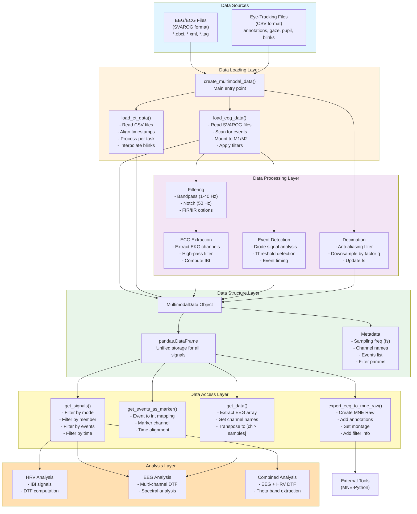
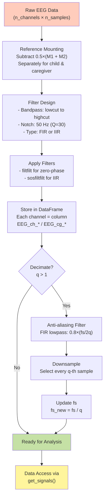
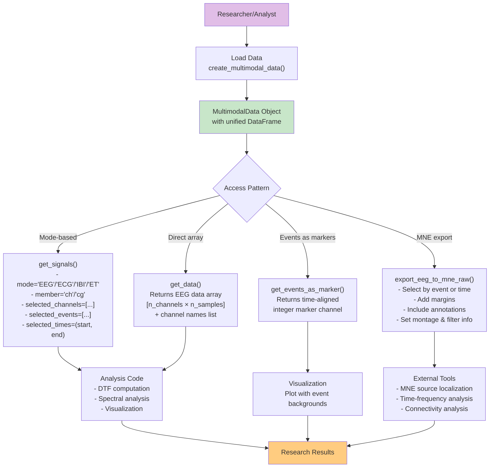

# Hyperscanning Signal Analysis - Architecture Diagram

## System Architecture Overview



## Detailed Component Diagram

```mermaid
flowchart LR
    subgraph DataFrame["MultimodalData.data (pandas.DataFrame)"]
        direction TB
        TC["Time Columns<br/>- time<br/>- time_idx"]
        EEGC["EEG Channels<br/>- EEG_ch_Fp1, Fp2, ...<br/>- EEG_cg_Fp1, Fp2, ..."]
        ECGC["ECG/IBI<br/>- ECG_ch, ECG_cg<br/>- IBI_ch, IBI_cg"]
        ETC["Eye-Tracking<br/>- ET_ch_x, y, pupil<br/>- ET_cg_x, y, pupil<br/>- ET_ch_blinks<br/>- ET_cg_blinks"]
        EVTC["Events<br/>- events (string)<br/>- EEG_events<br/>- ET_event"]
        DIODE["Diode<br/>- diode"]
    end

    subgraph Methods["Key Methods"]
        direction TB
        SET["Data Setters<br/>set_eeg_data()<br/>set_ecg_data()<br/>set_ibi()<br/>set_diode()<br/>set_EEG_events_column()"]
        GET["Data Getters<br/>get_signals()<br/>get_data()<br/>get_events_as_marker()"]
        PROC["Processing<br/>decimate_signals()<br/>interpolate_ibi_signals()<br/>create_events_column()<br/>create_event_structure()"]
        EXPORT["Export<br/>export_eeg_to_mne_raw()"]
    end

    DataFrame --> Methods
    
    style DataFrame fill:#c8e6c9
    style Methods fill:#b3e5fc
```



## Signal Processing Pipeline



## Event Processing Flow


## Data Access Patterns



## File Organization

```
hyperscanning-signal-analysis/
├── data/
│   └── {dyad_id}/
│       ├── eeg/
│       │   ├── {dyad_id}.obci      # Binary EEG data
│       │   ├── {dyad_id}.xml       # Channel configuration
│       │   └── {dyad_id}.tag       # Event markers
│       └── et/
│           ├── child/
│           │   ├── 000/            # Movies task
│           │   ├── 001/            # Talk 1 task
│           │   └── 002/            # Talk 2 task
│           └── caregiver/
│               ├── 000/
│               ├── 001/
│               └── 002/
│
├── src/
│   ├── dataloader.py              # Main data loading & processing
│   ├── data_structures.py         # MultimodalData class
│   ├── eyetracker.py              # ET-specific processing
│   ├── utils.py                   # Plotting & utility functions
│   └── mtmvar.py                  # DTF computation
│
├── scripts/
│   ├── mne_export_demo.ipynb      # MNE export examples
│   ├── get_data_demo.ipynb        # Data access examples
│   ├── filter_demo.ipynb          # Filter design & testing
│   ├── decimation_test.ipynb      # Decimation testing
│   ├── EEG_ET_synch_test.ipynb    # Synchronization checks
│   ├── Example_DataLoader_usage.ipynb
│   └── warsaw_pilot_data.py       # Analysis pipeline
│
├── tests/
│   ├── test_dataloader.py
│   └── test_data_structures.py
│
└── docs/
    ├── data_structure_spec.md
    └── architecture_diagram.md     # This file
```

## Key Design Principles

1. **Unified Storage**: All signals (EEG, ECG, IBI, ET) stored in single DataFrame
2. **Common Sampling**: All signals resampled to common `fs` (typically 1024 Hz or decimated)
3. **Time Alignment**: Time column aligned so first movie event starts at t=0
4. **Flexible Access**: Multiple methods to retrieve data by mode, member, event, or time
5. **Immutable Decimation**: `decimate_signals()` returns new object, preserves original
6. **Event Integration**: Events from both EEG (diode) and ET (annotations) merged and validated
7. **MNE Compatibility**: Export to MNE format with proper annotations and filter info
8. **Modular Processing**: Separate functions for loading, filtering, and processing each modality

## Signal Flow Summary

```
Raw Files → Load → Mount/Reference → Filter → Extract ECG/IBI → 
Store in DataFrame → Decimate (optional) → Align Events → 
Access via get_signals()/get_data() → Analysis (DTF, HRV, etc.) → Results
```

## Common Usage Patterns

### Pattern 1: Load and Extract EEG for Event
```python
# Load data
mmd = create_multimodal_data(data_base_path, dyad_id)

# Get EEG for specific event
time, channels, data = mmd.get_signals(
    mode='EEG', 
    member='ch',
    selected_channels=['Fz', 'Cz', 'Pz'],
    selected_events=['Brave']
)
```

### Pattern 2: Export to MNE with Time Selection
```python
# Export specific time window
raw, times = export_eeg_to_mne_raw(
    mmd, 
    who='cg',
    times=(100.0, 300.0)  # 100s to 300s
)
raw.plot()
```

### Pattern 3: Export Event with Margins
```python
# Export event with margins for baseline
raw, times = export_eeg_to_mne_raw(
    mmd, 
    who='ch',
    event='Incredibles',
    margin_around_event=10.0  # 10s before and after
)
# MNE annotations will include event timing
raw.annotations
```

### Pattern 4: Direct Array Access
```python
# Get EEG as numpy array
eeg_data, channel_names = get_data(
    df=mmd.data,
    who='ch'
)
# eeg_data shape: [n_channels × n_samples]
# channel_names: ['Fp1', 'Fp2', 'F7', ...]
```

### Pattern 5: Multi-modal Analysis
```python
# Get synchronized signals
eeg_time, eeg_ch, eeg_data = mmd.get_signals('EEG', 'ch', ...)
ibi_time, ibi_ch, ibi_data = mmd.get_signals('IBI', 'ch', ...)
et_time, et_cols, et_data = mmd.get_signals('ET', 'ch', ...)
```

---

*This architecture supports hyperscanning (dual-EEG) analysis with synchronized eye-tracking and cardiac signals for child-caregiver dyad studies.*
